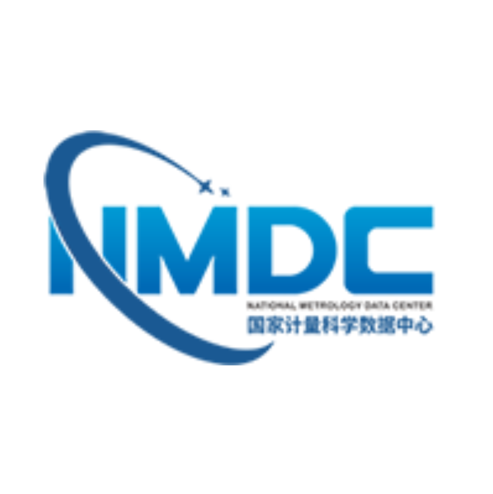

   
  <h1>国家计量科学数据中心 (NMDC)</h1>
  

    <a href="https://www.nmdc.ac.cn">🌐 官方网站</a> ·
    <a href="https://github.com/orgs/NIM-NMDC/discussions">💬 讨论</a>
  

  
<b>计量科学数据 · 开放共享 · 精准服务</b>

  
<b>Metrology Science Data · Open Sharing · Precision Services</b>

---

## 🏛️ 关于我们

我们致力于：

- **汇聚与管理**：收集、整合、保存计量领域的科学数据、参考数据和标准物质信息
- **开放共享**：构建公共数据服务平台，为科研、产业和社会提供权威的数据资源
- **工具与标准**：研发数据采集、分析、可视化工具，推广计量数据标准与规范

本组织是 NMDC 在 GitHub 上的开源技术阵地，所有核心代码、工具、文档均在此协同开发。

### About Us

We are committed to:

- **Curation & Management**: Collecting, integrating, and preserving scientific data, reference data, and standard reference materials in metrology.
- **Open Sharing**: Building a public data service platform to provide authoritative data resources for research, industry, and society.
- **Tools & Standards**: Developing data acquisition, analysis, and visualization tools, and promoting metrology data standards and specifications.

This organization is the open‑source technology hub of NMDC on GitHub, where all core code, tools, and documentation are collaboratively developed.

---

## 📦 项目与仓库介绍

| 仓库                                          | 分类 tag                              | 中文说明                                                                    | English description                                                                                                                    |
| ------------------------------------------- | ----------------------------------- | ----------------------------------------------------------------------- | -------------------------------------------------------------------------------------------------------------------------------------- |
| `evidence-tiered-msms-lipidomics-mtbls2838` | 质谱 / MS                             | MTBLS2838 质谱脂质组研究的代码与衍生数据，包含检索汇总、脂质特征解析、丰度锚定、敏感性分析和复现清单。                | Code and derived data for an evidence-tiered MS/MS lipidomics study of MTBLS2838, with reproducibility manifests and analysis outputs. |
| `RFDD-SRD`                                  | 数据集 / Dataset                       | RFDD-SRD 数据集仓库。                                                         | Dataset repository.                                                                                                                    |
| `OMT`                                       | 计量数字化 / Digitalization of Metrology | Measurement Terminology 本体，面向数字计量与数字校准证书 DCC 的机器可解释语义框架。                | Ontology for Measurement Terminology, providing a semantic foundation for digital metrology and DCCs.                                  |
| `TCM-MS2Link`                               | 质谱 / MS 数据集 / Dataset            | 融合中药-化合物关联知识与 MS/MS 谱图数据的 AI-ready 数据集；包含 TCM-MolLink 与 MS2-MLReady 两层。 | An AI-ready dataset integrating TCM herb–compound knowledge with MS/MS spectral data.                                                  |
| `FD-TamperBoard`                            | 数据集 / Dataset                       | 加油机 PCB 篡改特征图像数据集，用于非法计量检测与反作弊视觉识别。                                     | A fuel-dispenser PCB tampering-feature image dataset for computer-vision-based illicit metering detection.                             |
| `RFDD`                                      | 数据集 / Dataset                       | 高铁扣件缺陷检测数据集，含像素级标注与目标检测基准，覆盖缺失、反装、位移、变形、断裂等类别。                          | Railway Fastener Defect Dataset for fine-grained defect detection with pixel-level annotations and benchmark models.                   |
| `MSIMG`                                     | 质谱 / MS                             | 将 LC-MS 质谱数据转换为多通道图像表示的深度学习方法代码，用于表型分类等任务。                              | Official implementation of MSIMG, a density-aware multi-channel image representation method for mass spectrometry.                     |
| `PDFM-as-VAE-TDW`                           | 质谱 / MS                             | VAE-TDW 在分析化学中的实现代码，仓库主要包含 README 与 Python 实现文件。                        | Python implementation of VAE-TDW for analytical chemistry applications.                                                                |
| `D-SI-nim`                                  | 计量数字化 / Digitalization of Metrology | 面向 DCC 的机器可解释、可溯源 D-SI 元模型，支持单位表达式解析、校验与 SI 参考点追溯。                      | A machine-interpretable and traceable Digital-SI meta-model for unit validation and authoritative traceability in DCCs.                |
| `PSTUN`                                     |                                     | 高光谱与多光谱图像任意尺度融合模型 PSTUN，包含仿真、任意尺度融合与真实场景锐化模块。                           | Perceptive Spectral Transformer Unfolding Network for arbitrary-scale hyperspectral and multispectral image fusion.                    |

## 🤝 贡献与参与

我们欢迎社区贡献！参与方式：

1. 查阅 [`CONTRIBUTING.md`](https://github.com/NIM-NMDC/.github/blob/main/CONTRIBUTING.md)（可在 `.github` 仓库中创建）
2. 通过 Issue 提交问题或建议
3. Fork 仓库并发起 Pull Request

有任何疑问，请通过邮箱联系我们。

### Contributing

We welcome community contributions! How to participate:

1. Read the [`CONTRIBUTING.md`](https://github.com/NIM-NMDC/.github/blob/main/CONTRIBUTING.md) (which you can create in the `.github` repository).
2. Submit issues or suggestions via Issues.
3. Fork a repository and open a Pull Request.

For any questions, feel free to reach out through email.

---

  © 2025 NIM-NMDC · 计量科学数据，赋能精准未来
  © 2025 NIM-NMDC · Metrology Science Data, Empowering a Precise Future

